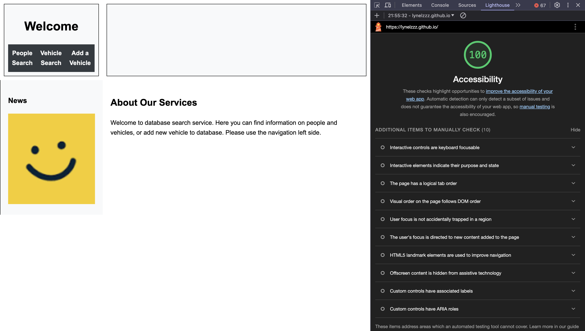
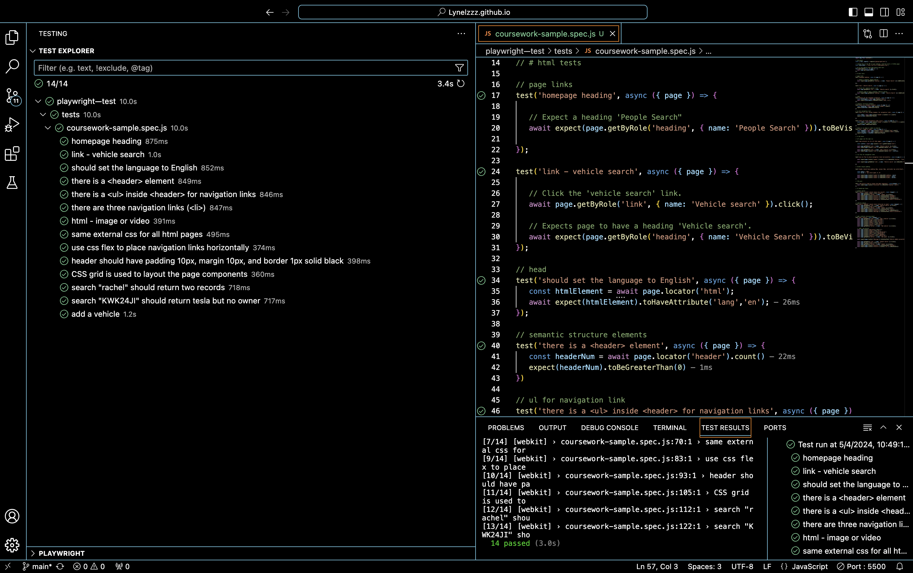
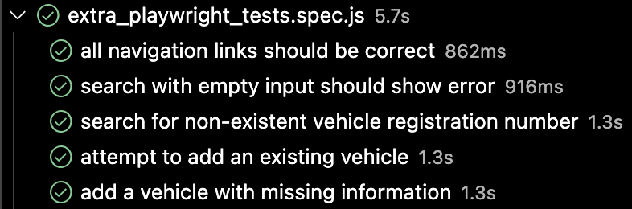

# Lynelzzz.github.io

# COMP1004 Coursework Documentation

## Project Overview
This document provides detailed information on the additional efforts and implementations made in the HTML, CSS, JavaScript, and database components of the coursework project. Each section highlights specific enhancements and standards compliance that go beyond coursework requirements.

## HTML Enhancements
### Files Structure
- `index.html`, `people.html`, `vehicles.html`, `add_vehicles.html`
- All files are named in lowercase and use underscore instead of spaces.

### Semantic HTML
- Utilised HTML5 semantic tags such as `<header>`, `<footer>`, `<aside>`, and `<main>` across all pages.
- Each page has a coherent structure that includes a header, main content area, sidebar, and footer.

### Navigation
- Implemented a consistent navigation menu across all pages using `<ul>` within `<header>`.
- Ensured all navigation links are functional and correctly link to their respective pages.

### Accessibility
- Conducted accessibility checks using the Lighthouse tool, achieving a 100% accessibility score.

- Ensured that images include alt text and interactive elements are accessible via keyboard.

## CSS Enhancements
### External Styling
- Used a single external CSS file (`style.css`) to style all HTML pages, ensuring design consistency.

### Layout with CSS Grid
- Implemented a CSS Grid layout correctly:
```
#container {
    display: grid;
    grid-template-areas:
        "header header header"
        "aside main main"
        "footer footer footer";
    grid-template-columns: 1fr 4fr;
    grid-template-rows: auto 1fr auto;
}
```
 - This layout responds to changes in viewport size, maintaining the structural integrity of the page layout.

### Responsive Design
- Employed media queries to adjust layout for devices with a maximum width of 500px:
```@media (max-width: 500px) {
    #container {
        grid-template-areas:
            "header"
            "main"
            "aside"
            "footer";
        grid-template-columns: 1fr;
        grid-template-rows: auto 1fr auto auto;
    }
    nav ul {
        flex-direction: column;
    }
}
```
- These adjustments ensure that the website remains usable and visually appealing across a range of devices.

## JavaScript Enhancements
- Implemented client-side validation to ensure that form submissions are checked before being sent to the server.
- Enhanced user interaction by providing dynamic content updates without needing to reload the page.

### Error Handling
- Added error handling across all JavaScript functions to manage exceptions and provide useful error messages to the user.

## Database Integration
- Successfully connected the frontend to a Supabase backend using REST API.
- Ensured that all database interactions perform as expected in querying and updating records.

## Playwright Testing 
- Ensured that all requirements for Playwright automatic testing have been met.


##  Additional Playwright Tests 

 ### 1. Navigation Link Verification
- Ensure all navigation links direct to the correct pages.

```
test('all navigation links should be correct', async ({ page }) => {
    const expectedLinks = [
        { text: 'Home', href: 'index.html' },
        { text: 'Vehicle Search', href: 'vehicles.html' },
        { text: 'Add a Vehicle', href: 'add_vehicles.html' }
    ];
    await page.goto(websiteURL);
    for (const link of expectedLinks) {
        const href = await page.getByRole('link', { name: link.text }).getAttribute('href');
        expect(href).toBe(link.href);
    }
});
```
 ### 2. Search with Empty Input Error Handling
- Check that the application correctly handles empty search inputs by displaying an error message.
```
test('search with empty input should show error', async ({ page }) => {
    await page.locator('#name').fill('');
    await page.getByRole('button', { name: 'Submit' }).click();
    await expect(page.locator('#message')).toContainText('Error');
});
```
### 3. Non-existent Vehicle Registration Number Search
- Test the application's response when a non-existent vehicle registration number is searched. 

```
    test('search for non-existent vehicle registration number', async ({ page }) => {
    await page.getByRole('link', { name: 'Vehicle search' }).click();
    await page.locator('#rego').fill('NONEXIST123');
    await page.getByRole('button', { name: 'Submit' }).click();
    await expect(page.locator('#message')).toContainText('No result found');
});
```
### 4. Existing Vehicle Addition Error
- Check the system's response when there is an attempt that is made to add a vehicle that already exists in the database.
```
test('attempt to add an existing vehicle', async ({ page }) => {
    await page.getByRole('link', { name: 'Add a vehicle' }).click();
    await page.locator('#rego').fill('EXIST123'); 
    await page.getByRole('button', { name: 'Add vehicle' }).click();
    await expect(page.locator('#message')).toContainText('Error');
});
```
### 5. Vehicle Addition with Missing Information
- Ensure that the application prevents the addition of a vehicle when required fields are missing.
```
test('add a vehicle with missing information', async ({ page }) => {
    await page.getByRole('link', { name: 'Add a vehicle' }).click();
    await page.locator('#rego').fill('NEWREG123');
    await page.getByRole('button', { name: 'Add vehicle' }).click();
    await expect(page.locator('#message')).toContainText('Error');
});
```
## Pass Screenshot
